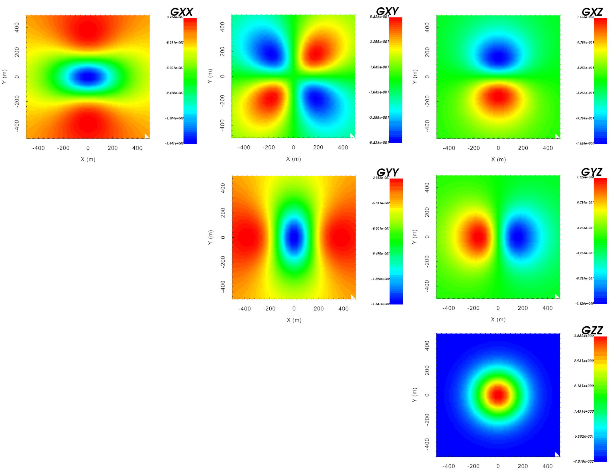

.. _example_fwd:

Forward Modeling
================

Here the code **ggfor3d.exe** is used to forward model gravity gradiometry data for the mesh and density contrast model provided. We consider a ground-based survey with a uniform station spacing of 40 m.

Files relevant to this part of the example are in the sub-folder *fwd*. We used the same model that was created in the :ref:`create model <example_model>` section. Before running this example, you may want to do the following:

	- `Download and open the zip folder containing the entire gg3d v6 example <https://github.com/ubcgif/gg3d/raw/master/assets/gg3d_v6_example.zip>`__ (if not done already)
	- Learn how to run :ref:`ggfor3d <gg3d_fwd>`
	- There is no input file

The resulting gravity gradiometry components in Eotvos are shown below. According to the convention used by *gg3d*: x is Northing, y is Easting and z is +ve downward. This produces a +ve gzz anomaly higher density structures.

