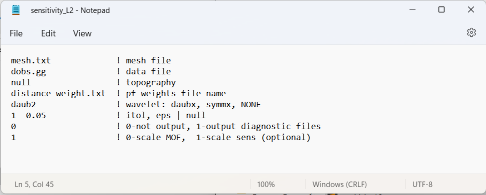
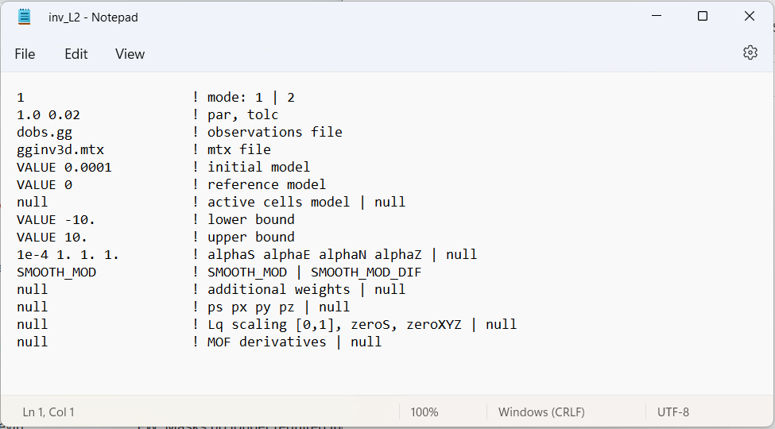

.. _example_inv_L2:

Least-Squares Inversion
=======================

Here, we use **ggsen3d.exe** to compute the sensitivity matrix required for the inversion; which is scaled by distance weighting provided. We then use **gginv3d.exe** to perform a least-squares inversion and recover a density contrast model. To keep the example simple, we added Gaussian noise with a standard deviation of 0.1 Eotvos to all data. We then assigned uncertainties of 0.1 Eotvos to all data. In practice, the noise on the data is not trivial to quantify and choosing appropriate uncertainties is very important for successful inversion.

Files relevant to this part of the example are in the sub-folder *inv_L2* . Before running this example, you may want to do the following:

    - `Download and open the zip folder containing the entire gg3d v6 example <https://github.com/ubcgif/gg3d/raw/master/assets/gg3d_v6_example.zip>`__ (if not done already)
    - Learn how to run :ref:`ggsen3d.exe <gg3d_sens>` and :ref:`gginv3d.exe <gg3d_inv>` from the command line
    - Learn the format of the :ref:`input file for ggsen3d.exe <gg3d_sens_input>` and of the :ref:`input file for gginv3d.exe <gg3d_inv_input>`

Sensitivities
-------------

Here, the code **ggsen3d.exe** and the input file **sens.inp** (:ref:`see format <gg3d_sens_input>`) are used to construct the sensitivity matrix and scale it using distance weighting. The distance weighting is applied to the sensitivity matrix to counteract the inversion's natural tendancy to incorrectly place anomalous structures near the observation locations. 

To compute the sensitivities, the following input file was used. Since we are performing a least squares inversion, a flag of *1* is entered on the last line of the input file.

Inversion
---------

Here, the code **gginv3d.exe** and the input file **inv.inp** (:ref:`see format<gg3d_inv_input>`) was used to recover a susceptibility model. You cannot perform the inversion until you have created the sensitivity matrix.

The true model (left) and the final recovered model (right) are shown below. The least-squares inversion almost always recovers a smooth structure that underestimates the amplitude of the target. With distance weighting however, the center location of the recovered body is consistent with the true model.

.. figure:: images/model_L2.png
     :align: center
     :width: 700

