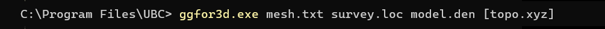

.. _gg3d_fwd:

Forward Modeling
================

The program **ggfor3d.exe** performs the 3D forward modelling of gravity gradiometry data for a density contrast model defined on a tensor mesh.

Running the Program
^^^^^^^^^^^^^^^^^^^

To run the executable, open a command window. In order, enter the path to the *ggfor3d* executable, the :ref:`tensor mesh file <meshfile>`, the :ref:`survey file <ggfile>`, the :ref:`density contrast model file <modelfile>` and a :ref:`topography file <topofile>` (optional). This in shown below.

Units
^^^^^

    - **Data:** gravity gradiometry in Eotvos
    - **Model:** density contrast model in g/cc

Output Files
^^^^^^^^^^^^

The program **ggfor3d.exe** creates the following output files:

    - **ggfor3d.gg:** Predicted data file.

    - **ggfor3d.log:** Log file which provides details about the parameters used in the forward modelling and diagnostic information about the results.

